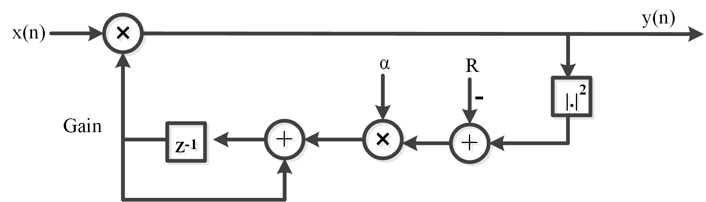

# Fixed-Point Adaptive Gain Control (AGC) in MATLAB

A MATLAB simulation of a feedback **Automatic Gain Control (AGC)** loop implemented with the Fixed-Point Designer `fi` type. The loop adapts a gain `g[n]` so that the **power of the output** tracks a reference level `R`. All signals and coefficients are 16-bit signed fixed-point (Q1.15).

## Algorithm

The AGC uses a simple LMS-style gain update driven by the power error:

```
y[n]   = g[n] * x[n]
e[n]   = R - y[n]^2
g[n+1] = g[n] + alpha * e[n]
```

- If the output power is below `R`, the error is positive and the gain increases.
- If the output power is above `R`, the error is negative and the gain decreases.
- `alpha` is the step size (loop speed): larger values adapt faster but are noisier.

## Block Diagram



## Parameters

| Parameter | Value | Description |
|---|---|---|
| `N` | 200 | Number of samples |
| `alpha` | 0.01 | Adaptation step size |
| `R` | 1 | Reference (target) output power |
| `WL` / `FL` | 16 / 15 | Word length / fraction length (signed Q1.15) |

Range of Q1.15: `-1` to `1 - 2^-15 ≈ 0.99997`, resolution `2^-15 ≈ 3.05e-5`.

## Implementation Details

- Input `x = randn(1,N)` (Gaussian noise) is quantized to `fi(1,16,15)`.
- Every intermediate result (`g*x`, squared term, gain update) is cast back to 16-bit Q1.15, which models the quantization done in hardware.
- `fi` defaults apply: **round to nearest** and **saturate** on overflow.
- The script plots three subplots: the fixed-point input, the fixed-point output `y`, and the adaptive gain `g`.

## Files

| File | Description |
|---|---|
| AGC script | Fixed-point AGC simulation and plots |

## How to Run

Run the script in MATLAB. Requires **Fixed-Point Designer** (for `fi`).

## Notes and Limitations

Running this configuration (replicated numerically) shows the loop is **not really adapting**:

- **The gain is pinned at the maximum.** Q1.15 cannot represent `1`, so `R` and `g(1)` saturate to `0.99997`. The gain can never exceed this value, so the AGC can only attenuate, never amplify. In the simulation `g` stays at `0.99997` for all samples.
- **The target is unreachable.** With `R = 1` and `|y| < 1`, the error `R - y^2` is almost always positive, so the gain keeps trying to increase and just saturates.
- **The input is clipped.** `randn` has values above 1 in magnitude (about 27% of samples), which saturate in Q1.15, so `x_q` is not a clean Gaussian.
- **Last output sample is zero.** The loop runs to `N-1`, so `y(N)` is never computed.
- `abs_block` actually computes the **square** of the signal (a power detector), not an absolute value.
- The input is different on every run (no `rng` seed).

### Suggested improvements

- Use a reference that fits the format, for example `R = 0.25` (target output RMS of 0.5).
- Scale the input (for example `x = 0.25*randn(1,N)`) so it does not clip.
- Give the gain more integer bits (for example `fi(...,1,16,12)` for `g`) so it can exceed 1, and start with `g(1) = 1`.
- Add `rng(1)` for reproducible runs, and loop to `N` so `y(N)` is filled.
- Test with an input whose amplitude changes over time (e.g., a step in amplitude) to see the gain actually adapt.
